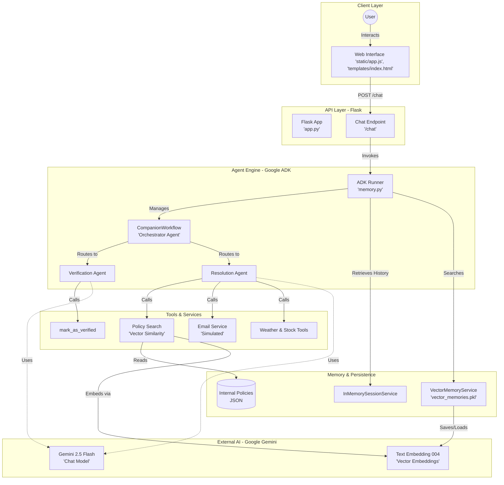

 # Architecture Overview

This document describes the technical architecture of the AI Companion project, a Flask-based intelligent agent system built using the **Google Agent Development Kit (ADK)** and **Gemini**.

## Architecture Diagram

## Component Descriptions

### 1. Client Layer
*   **Web Interface:** A frontend built with vanilla JavaScript (`static/app.js`) and HTML/CSS. It handles user interactions, including text input and speech synthesis for the agent's voice.

### 2. API Layer (Flask)
*   **Flask App (`app.py`):** Acts as the entry point and orchestrator for the web requests.
*   **Chat Endpoint:** A POST route that receives messages, identifies the user session and industry mode, and invokes the ADK Runner.

### 3. Agent Engine (Google ADK)
*   **ADK Runner:** Manages the lifecycle of the agent, including session state and memory integration.
*   **CompanionWorkflow:** A custom `BaseAgent` implementation that acts as a router. It ensures that users are **Verified** before they can access **Resolution** logic.
*   **Verification Agent:** An `LlmAgent` specialized in extracting and confirming user identity (Name, Booking ID, Email).
*   **Resolution Agent:** An `LlmAgent` that handles complaints by searching policies and offering compensation.

### 4. Tools & Services
*   **Policy Search:** Implements vector-based retrieval (RAG) to find the most relevant compensation tiers for a guest's complaint.
*   **Email Tool:** Simulates sending confirmation emails for high-tier resolutions.
*   **Verification Tool:** Updates the internal session state once verification is successful.

### 5. Memory & Persistence
*   **Vector Memory Service:** Uses Gemini embeddings to store and retrieve past conversation snippets from a local `vector_memories.pkl` file.
*   **Session Service:** Manages short-term conversation history within a single interaction.
*   **Internal Policies:** A static knowledge base of refund and compensation rules.

### 6. External AI (Google Gemini)
*   **Gemini 2.5 Flash:** The primary LLM used for natural language understanding and generation across all agents.
*   **Text Embedding 004:** Used for generating vector representations of conversation history and policy documents.
